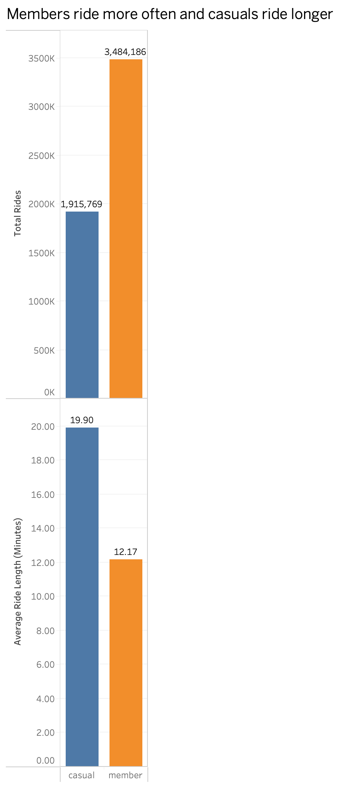
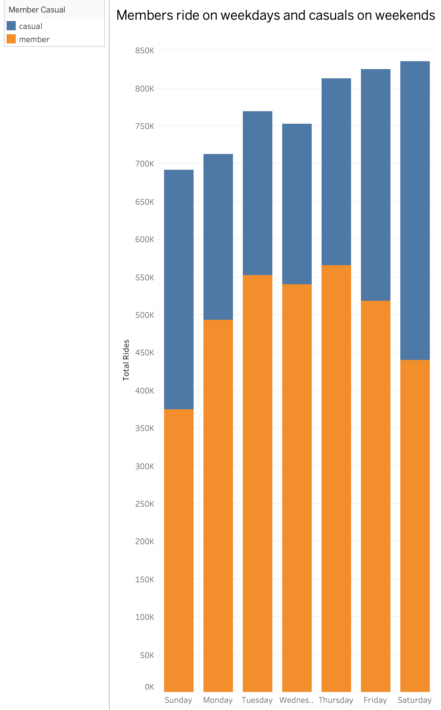
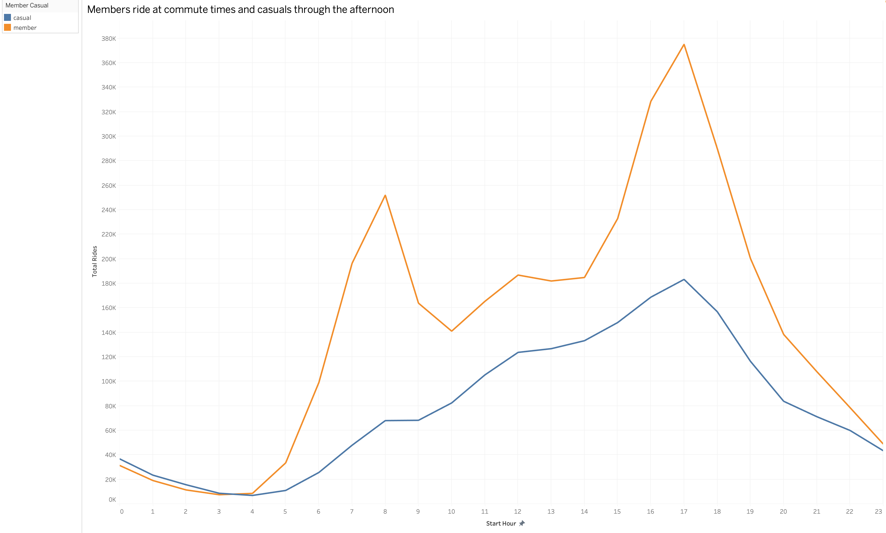
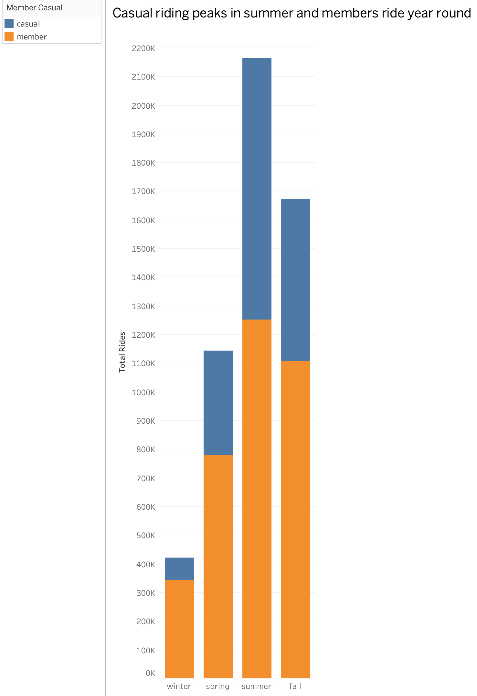

# Cyclistic Bike Share Analysis (2025)

Analysis of a full year of Cyclistic bike share trips (2025) to understand how
**casual riders** and **annual members** use the service differently, and to
recommend where the business should focus its casual to member conversion effort.

**Tools:** SQL · BigQuery · Tableau

---

## Business question

Cyclistic's growth strategy depends on converting casual riders into annual
members. To do that, the business first needs to understand a simple question:

> **How do casual riders and annual members use the bikes differently, and where
> is the best opportunity to convert casuals into members?**

---

## Approach

The analysis was built as a small, layered data pipeline in BigQuery:

1. **Setup (`01_setup.sql`)** – cleans and standardises the raw 2025 trip data
   into a partitioned, clustered analysis table (`fact_rides`). This includes
   typing and trimming fields, filtering out invalid rows, and removing
   implausible trips (under 1 minute or over 24 hours), and it adds derived
   fields for date, day of week, hour, season and ride length.
2. **Quality checks (`02_quality_checks.sql`)** – validates the cleaned table
   before any analysis: row count reconciliation, duplicate and null checks,
   ride duration ranges, coordinate bounds, and date coverage. This step exists
   to make sure conclusions rest on trustworthy data.
3. **Analysis (`03_kpis.sql`)** – compares members and casuals across ride
   volume, ride length, day of week, hour of day, season, bike type and top
   start stations.

Results were visualised in Tableau (see `/charts`).

---

## Key findings

The data tells one consistent story: **members commute, casuals ride for leisure.**

### Members ride more often, casuals ride longer

Members take far more rides but much shorter ones. Casual riders averaged
roughly twice the ride length of members. Members are frequent and short;
casuals are occasional and long.

### Members ride on weekdays, casuals on weekends

Member rides peak on weekdays and dip on weekends. Casual rides do the
opposite, peaking on Saturday and Sunday. This is a clear weekday commuter
versus weekend leisure split.

### Members ride at commute times, casuals through the afternoon

Members show sharp peaks around 8am and 5pm, matching a commute pattern.
Casual rides build through late morning into the afternoon, matching leisure
use.

### Casual riding peaks in summer, members ride year round

Casual riding is highly seasonal, swinging from a quiet winter to a busy
summer, while member riding stays far steadier across the year. Casual riders
are largely fair weather riders.

### Casuals start at tourist stations, members at commuter hubs

The starting locations separate the two groups clearly. Top casual stations are
tourist and waterfront destinations (for example DuSable Lake Shore Drive, Navy
Pier, Streeter Drive, Millennium Park). Top member stations are downtown
commuter hubs (for example Kingsbury & Kinzie, Clinton & Washington, Canal
Street).

---

## Recommendation

To convert casual riders into annual members, focus marketing on **weekend and
summer leisure riders at the lakefront and tourist stations** (such as Navy
Pier, Millennium Park and the DuSable Lake Shore Drive docks), with messaging
built around leisure and value rather than commuting.

This targets the conversion effort at the specific riders, places and times of
year where casual usage is highest, rather than spreading it evenly.

---

## Repository contents

| File | Purpose |
| --- | --- |
| `01_setup.sql` | Builds and cleans the data into the `fact_rides` analysis table |
| `02_quality_checks.sql` | Validates the cleaned data before analysis |
| `03_kpis.sql` | Analysis queries comparing members and casuals |
| `/charts` | Tableau visualisations supporting the findings |

---

## Notes

- Data covers Cyclistic trips for the 2025 calendar year.
- Trips shorter than 1 minute or longer than 24 hours were excluded as likely
  errors or non genuine rides.
- "Cyclistic" is a fictional company used for this analysis; the underlying
  trip data is from a public bike share dataset.
